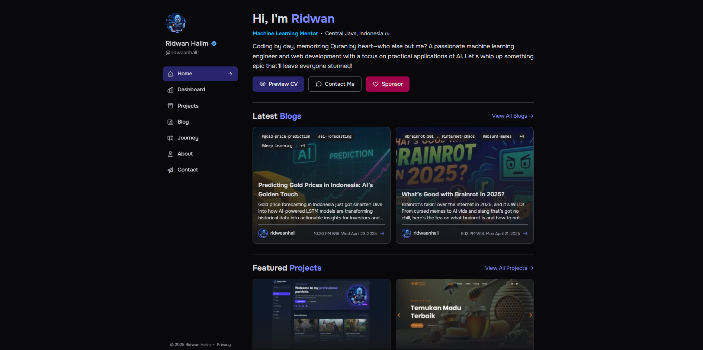

# ridwaanhall.com

🔥 I built my personal site from *scratch* with Django and TailwindCSS, and it’s straight-up 🔥. Hosted on Vercel for that smooth vibe. 😎



---

## Coding Time Flex 💪⏱️

Check it - I've put some serious hours into building this bad boy! The Wakatime badge below shows exactly how much time I've spent in the code trenches making this site awesome:

[](https://wakatime.com/badge/user/018b799e-de53-4f7a-bb65-edc2df9f26d8/project/cc5b6b55-ece5-47ae-b643-512d9d86e93b)

Every minute tracked, every line of code counted. This is what dedication looks like! 🔥

## What's This?

Welcome to my digital crib! This site’s my personal brand, showing off my skills with a clean, responsive design. I coded it from the ground up using Django for the backend and TailwindCSS for that slick frontend look. It’s got all the deets on my projects, work, and who I am. Wanna peek under the hood? Dive into the code and see how I made it pop. 🚀

## Tech Stack

| Component | Tech/Tools |
|-----------|------------|
| Code Vibes |  |
| Backend |  |
| Frontend |  |
| Version Control |   |
| Hosting |  |
| CDN |  |
| Analytics |    |
| Speed Boost |  |
| Security |  |
| Extra Sauce |    |

## PageSpeed Insights

My site’s *fast* AF, optimized for all devices, and flexing near-perfect scores on Google PageSpeed Insights. 🏎️

### Desktop Vibes

[](https://pagespeed.web.dev/analysis/https-ridwaanhall-me/hzo9v4pstz?form_factor=desktop)
[](https://pagespeed.web.dev/analysis/https-ridwaanhall-me/hzo9v4pstz?form_factor=desktop)
[](https://pagespeed.web.dev/analysis/https-ridwaanhall-me/hzo9v4pstz?form_factor=desktop)
[](https://pagespeed.web.dev/analysis/https-ridwaanhall-me/hzo9v4pstz?form_factor=desktop)


### Mobile Flow

[](https://pagespeed.web.dev/analysis/https-ridwaanhall-me/hzo9v4pstz?form_factor=mobile)
[](https://pagespeed.web.dev/analysis/https-ridwaanhall-me/hzo9v4pstz?form_factor=mobile)
[](https://pagespeed.web.dev/analysis/https-ridwaanhall-me/hzo9v4pstz?form_factor=mobile)
[](https://pagespeed.web.dev/analysis/https-ridwaanhall-me/hzo9v4pstz?form_factor=mobile)


## What's Poppin'?

| Feature | What's Good |
|---------|-------------|
| JSON Data | No database, just JSON-Python files for easy content updates. 😎 |
| Responsive Design | Looks dope on any screen size, from phone to big monitor. |
| Portfolio Glow-Up | Showcasing my projects with slick descriptions and visuals. |
| Dashboard | Interactive stats from WakaTime and GitHub, flexing my code game. |
| About Me | My story, skills, and professional vibe in one spot. |
| Blog/Articles | Dropping knowledge and hot takes on tech and more. |
| Resume/CV | My work history and skills, ready to impress. |
| Social Media | Links to my profiles so you can slide into my DMs. |
| SEO Game | Optimized so Google and Bing can’t miss me. 🔍 |

## Get It Running

### Quick Start

```bash
git clone https://github.com/ridwaanhall/ridwaanhall_com.git
cd ridwaanhall_com
python -m venv venv
# Windows: venv\Scripts\activate | macOS/Linux: source venv/bin/activate
pip install -r requirements.txt
python manage.py runserver
```

### Set Up the Vibes

Drop a `.env` file in the root with:

```txt
SECRET_KEY="YOUR_DJANGO_SECRET_KEY"
ACCESS_TOKEN="YOUR_GITHUB_ACCESS_TOKEN"
WAKATIME_API_KEY="YOUR_WAKATIME_API_KEY"
```

- **SECRET_KEY**: Run `python -c "from django.core.management.utils import get_random_secret_key; print(get_random_secret_key())"`
- **ACCESS_TOKEN**: Grab one at [GitHub Settings/Tokens](https://github.com/settings/tokens)
- **WAKATIME_API_KEY**: Cop it from [WakaTime Settings](https://wakatime.com/settings/account)

### Make It Yours

Tweak content in `apps/data/appsname_data.py` to match your style.

## Project Layout

```txt
ridwaanhall_com/
├── apps/              # Where the magic happens
│   ├── data/          # Content files
│   ├── ...
├── staticfiles/       # CSS, JS, and images
├── templates/         # HTML templates
├── manage.py          # Django’s control center
└── ...
```

## Deploy It

Site’s live on Vercel, and you can make it yours:

1. Fork this repo.
2. Sign up for Vercel.
3. Create a new project and link your forked repo.
4. Add those `.env` variables in Vercel’s dashboard.
5. Hit deploy and watch it shine! 🌟

## Wanna Collab?

Got ideas? Slide in:

1. Fork the repo.
2. Create a branch (`git checkout -b feature/your-dope-idea`).
3. Make your changes.
4. Commit (`git commit -m 'Added some next-level stuff'`).
5. Push it (`git push origin feature/your-dope-idea`).
6. Open a Pull Request and let’s talk.

## Hit Me Up

| Platform   | Where to Find Me |
|------------|------------------|
| Email      | [hi@ridwaanhall.com](mailto:hi@ridwaanhall.com) |
| Website    | [ridwaanhall.com](https://ridwaanhall.com) |
| GitHub     | [@ridwaanhall](https://github.com/ridwaanhall) |
| Twitter/X  | [@ridwaanhall](https://x.com/ridwaanhall) |
