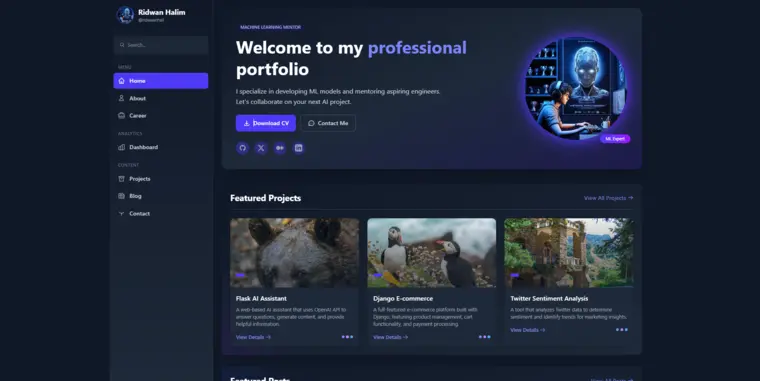

# ridwaanhall.me

🔥 Personal website was built originally from scratch using Django, Tailwind CSS, and HTML.



---

## Introduction

Welcome to my personal website repository! This site serves as my digital portfolio and personal brand showcase. The website features a clean, responsive design built completely from scratch using Django framework for the backend, with Tailwind CSS and HTML for the frontend styling.

This project demonstrates my web development skills and provides visitors with information about my work, projects, and professional background. Feel free to explore the codebase to see how I've implemented various features and optimized the site for performance.

## Tech Stack

- **Backend**: Django (Python web framework)
- **Frontend**: HTML, Tailwind CSS
- **Programming Languages**: Python
- **Deployment**: Vercel
- **Version Control**: Git

## Features

- **JSON Data Management**: Uses JSON files for content storage instead of a database, making data easy to update and modify
- **Responsive Design**: Fully responsive layout that works across all device sizes
- **Portfolio Showcase**: Curated collection of my projects with descriptions and images
- **Dashboard**: Interactive dashboard displaying coding metrics from WakaTime and GitHub activity statistics
- **About Me Section**: Professional background and personal introduction
- **Blog/Articles**: Sharing my thoughts and expertise on various topics
- **Resume/CV Display**: Professional experience and qualifications
- **Skills Showcase**: Visual representation of my technical skills
- **Social Media Integration**: Links to my professional profiles
- **SEO Optimization**: Enhanced discoverability through search engines

## Getting Started

### How to Use This Project

1. **Clone the Repository**

    ```bash
    git clone https://github.com/ridwaanhall/ridwaanhall_dev.git
    cd ridwaanhall_dev
    ```

2. **Create and Activate Virtual Environment**

    ```bash
    # On Windows
    virtualenv venv
    venv\Scripts\activate

    # On macOS/Linux
    virtualenv venv
    source venv/bin/activate
    ```

3. **Install Requirements**

    ```bash
    pip install -r requirements.txt
    ```

4. **Set Up Environment Variables**
    Create a `.env` file in the root directory and add necessary environment variables:

    ```txt
    SECRET_KEY="YOUR_DJANGO_SECRET_KEY"
    ACCESS_TOKEN="YOUR_GITHUB_ACCESS_TOKEN"
    WAKATIME_API_KEY="YOUR_WAKATIME_API_KEY"
    ```

5. **Run Development Server**

    ```bash
    python manage.py runserver
    ```

6. **Customize Content**
    You can modify the website content by editing the data files located in `apps/data/appsname_data.py`. This allows you to update information without changing the core application code.
