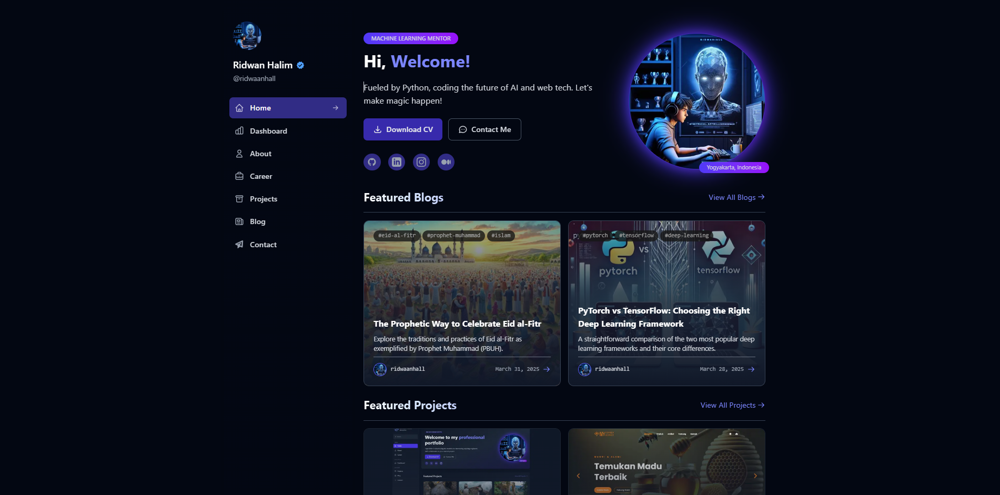
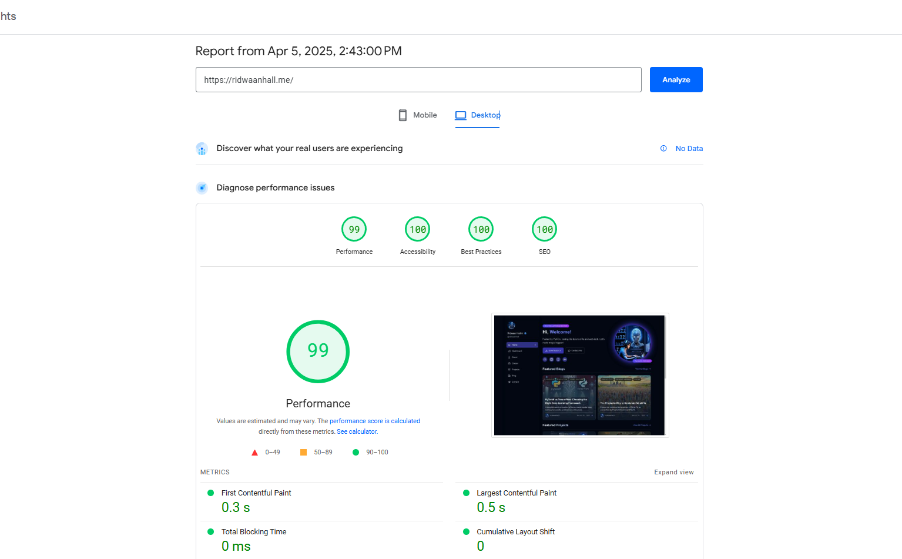
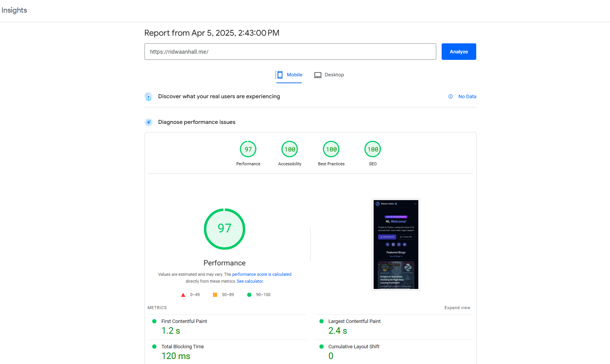

# ridwaanhall.com

🔥 Personal website was built originally from scratch using Django and TailwindCSS.



---

[](https://wakatime.com/badge/user/018b799e-de53-4f7a-bb65-edc2df9f26d8/project/cc5b6b55-ece5-47ae-b643-512d9d86e93b)

## Introduction

Welcome to my personal website repository! This site serves as my digital portfolio and personal brand showcase. The website features a clean, responsive design built completely from scratch using Django framework for the backend, with TailwindCSS for the frontend styling.

This project demonstrates my web development skills and provides visitors with information about my work, projects, and professional background. Feel free to explore the codebase to see how I've implemented various features and optimized the site for performance.

## Tech Stack

| Component | Technology/Tool |
|-----------|-----------------|
| Programming Languages |  |
| Backend |  |
| Frontend |  |
| Version Control |   |
| PaaS |  |
| CDN |  |
| Analytics |   |
| Performance |  |
| Security |  |
| Miscellaneous |    |

## PageSpeed Insights

The website has been optimized for performance across all devices, achieving near-perfect scores on Google PageSpeed Insights.

### Desktop Performance

[](https://pagespeed.web.dev/analysis/https-ridwaanhall-me/hzo9v4pstz?form_factor=desktop)
[](https://pagespeed.web.dev/analysis/https-ridwaanhall-me/hzo9v4pstz?form_factor=desktop)
[](https://pagespeed.web.dev/analysis/https-ridwaanhall-me/hzo9v4pstz?form_factor=desktop)
[](https://pagespeed.web.dev/analysis/https-ridwaanhall-me/hzo9v4pstz?form_factor=desktop)



### Mobile Performance

[](https://pagespeed.web.dev/analysis/https-ridwaanhall-me/hzo9v4pstz?form_factor=mobile)
[](https://pagespeed.web.dev/analysis/https-ridwaanhall-me/hzo9v4pstz?form_factor=mobile)
[](https://pagespeed.web.dev/analysis/https-ridwaanhall-me/hzo9v4pstz?form_factor=mobile)
[](https://pagespeed.web.dev/analysis/https-ridwaanhall-me/hzo9v4pstz?form_factor=mobile)



## Features

| Feature | Description |
|---------|-------------|
| JSON Data Management | Uses JSON-Python files for content storage instead of a database, making data easy to update and modify |
| Responsive Design | Fully responsive layout that works across all device sizes |
| Portfolio Showcase | Curated collection of my projects with descriptions and images |
| Dashboard | Interactive dashboard displaying coding metrics from WakaTime and GitHub activity statistics |
| About Me Section | Professional background and personal introduction |
| Blog/Articles | Sharing my thoughts and expertise on various topics |
| Resume/CV Display | Professional experience and qualifications |
| Skills Showcase | Visual representation of my technical skills |
| Social Media Integration | Links to my professional profiles |
| SEO Optimization | Enhanced discoverability through search engines |

## Getting Started

### Quick Setup

```bash
git clone https://github.com/ridwaanhall/ridwaanhall_dev.git
cd ridwaanhall_dev
python -m venv venv
# Windows: venv\Scripts\activate | macOS/Linux: source venv/bin/activate
pip install -r requirements.txt
python manage.py runserver
```

### Environment Configuration

Create a `.env` file in the root directory with:

```txt
SECRET_KEY="YOUR_DJANGO_SECRET_KEY"
ACCESS_TOKEN="YOUR_GITHUB_ACCESS_TOKEN"
WAKATIME_API_KEY="YOUR_WAKATIME_API_KEY"
```

- **SECRET_KEY**: Generate with `python -c "from django.core.management.utils import get_random_secret_key; print(get_random_secret_key())"`
- **ACCESS_TOKEN**: Generate at [GitHub Settings/Tokens](https://github.com/settings/tokens)
- **WAKATIME_API_KEY**: Available at [WakaTime Settings](https://wakatime.com/settings/account)

### Customization

Update content by modifying the data files in `apps/data/appsname_data.py`.

## Project Structure

```txt
ridwaanhall_dev/
├── apps/              # Django apps containing specific features
│   ├── data/          # Data files for content
│   ├── ...
├── staticfiles/       # Static files (CSS, JS, images)
├── templates/         # HTML templates
├── manage.py          # Django management script
└── ...
```

## Deployment

This site is deployed on Vercel. To deploy your own version:

1. Fork this repository
2. Create a Vercel account if you don't have one
3. Create a new project in Vercel and connect your forked repository
4. Configure environment variables in Vercel dashboard
5. Deploy!

## Contributing

Contributions are welcome! If you'd like to contribute:

1. Fork the repository
2. Create a new branch (`git checkout -b feature/improvement`)
3. Make your changes
4. Commit your changes (`git commit -m 'Add some feature'`)
5. Push to the branch (`git push origin feature/improvement`)
6. Open a Pull Request

## Contact

| Platform   | Contact                                               |
|------------|-------------------------------------------------------|
| Email      | [hi@ridwaanhall.com](mailto:hi@ridwaanhall.com) |
| Website    | [ridwaanhall.com](https://ridwaanhall.com)              |
| GitHub     | [@ridwaanhall](https://github.com/ridwaanhall)        |
| Twitter/X  | [@ridwaanhall](https://x.com/ridwaanhall)             |
