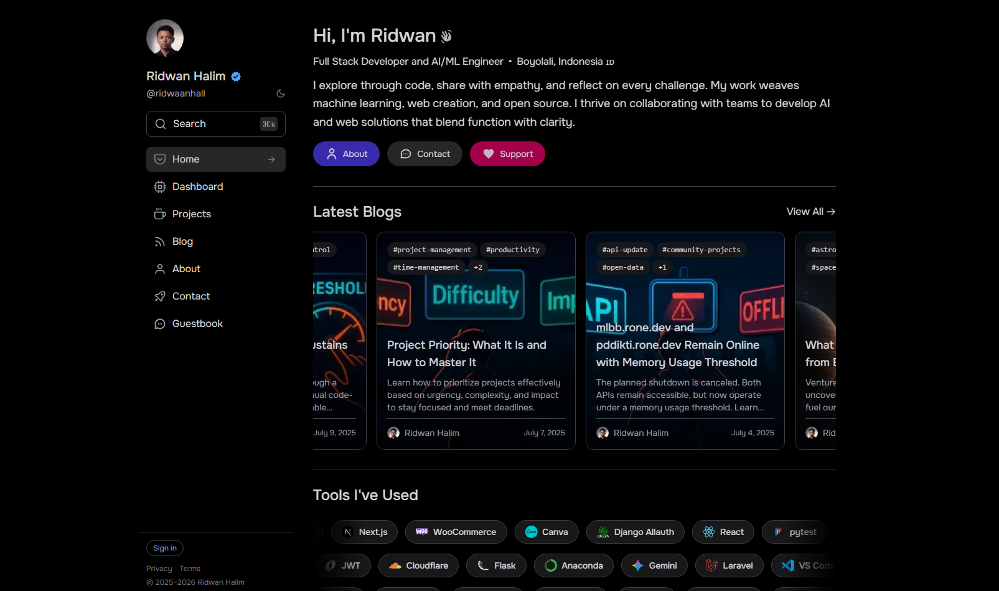

# ridwaanhall.com

[](https://nextjs.org/)
[](https://typescriptlang.org/)
[](https://tailwindcss.com/)
[](https://supabase.com/)



> **The portfolio behind [ridwaanhall.com](https://ridwaanhall.com) — database-backed content with its own admin, live GitHub and WakaTime dashboards, an OAuth guestbook with threaded replies, and light and dark themes. Fork it and make it your own; see [Making It Your Own](#making-it-your-own) below.**

## Key Features

- **Database-backed content**: Blog posts, projects, bio, experience, skills, awards, legal documents and more live as real tables — manage all of it from the `/admin` panel, with no deploy needed to change content
- **Supabase-powered**: Postgres and Storage (blog and project images, logos, the profile photo) both on Supabase, reached through Drizzle ORM and a small storage client rather than an SDK
- **Light and dark themes**: Dark by default, with a toggle in the sidebar and mobile navbar. Light mode is produced by remapping the Tailwind palette rather than by adding `dark:` variants, so both themes stay in sync automatically — see [Theming](#theming)
- **Content caching**: Every read path is behind `use cache` with a tag per content area, so an edit invalidates only what it touched. Tag revalidation is cross-instance by construction, which matters on serverless where an edit handled by one instance must not leave the others stale
- **Real-time dashboard**: Live GitHub contribution graph, WakaTime coding-activity stats, and a seven-day AI breakdown — tokens, estimated spend and cost by model — cut on Jakarta time and refreshed every 15 minutes
- **Interactive guestbook**: Google/GitHub OAuth login, threaded replies, pinning by staff (up to 3 at a time), deletion by a superuser, automatic link detection, email notifications routed on role — or disable it entirely with one env var
- **Blog and projects**: Paginated, searchable listings with multi-image support, tags, categories, threaded comments, and a project lifecycle status system
- **SEO built in**: Per-page meta tags, Open Graph, Twitter Cards, JSON-LD schema, and auto-generated sitemaps/robots.txt
- **Security-first**: row-level security on every Supabase table, an admin gated per screen — three roles and a view/add/change/delete grant on each of the thirty-five screens, all read from the database on every request and never carried in the session token — and Cloudflare Turnstile on the contact form
- **Image optimization**: `next/image` over the Supabase Storage origin, with the size ladder trimmed to what the layouts actually request
- **Built for touch as well as pointer**: mobile-first Tailwind CSS v4, with as little client JavaScript as the feature allows. Tooltips work on tap as well as hover, and every animation respects `prefers-reduced-motion`

## Tech Stack

- **Framework**: Next.js 16 (App Router, Turbopack, Cache Components), React 19, TypeScript
- **Styling**: Tailwind CSS v4
- **Database**: Supabase Postgres via Drizzle ORM over `node-postgres`
- **Media**: Supabase Storage, through a small REST client (`lib/storage/`)
- **Auth**: Auth.js v5 with Google and GitHub, over the existing account tables
- **Email**: Resend
- **APIs**: GitHub GraphQL, WakaTime
- **Spam**: Cloudflare Turnstile
- **Deployment**: Vercel


## Project Structure

```text
app/
  (site)/            The public pages: home, about, blog, projects, dashboard,
                     contact, guestbook, openhire, legal
  admin/             The admin. Two dynamic routes render all 35 screens
  api/               The few JSON endpoints the client actually calls
components/
  site/              Page components
  admin/             The generic changelist, form, field and inline renderers
  layout/            Sidebar, drawer, search palette, theme toggle
  providers/         Toasts, confirm dialog, tooltips, theme, click spark
lib/
  data/              Read paths, each behind `use cache` with a tag
  actions/           Server actions: contact, comments, guestbook, admin
  admin/             The descriptors that drive every admin screen
  auth/              The Auth.js adapter over the existing account tables
  db/                The generated Drizzle mapping and the connection pool
  email/             Templates and the Resend client
  seo/               Metadata, JSON-LD, sitemaps
  storage/           Supabase Storage: upload, delete, reference-counted cleanup
drizzle/             0000_init.sql — the whole schema, in one file
scripts/             Verification harnesses — see CLAUDE.md
styles/              The hand-written stylesheets app/globals.css imports
public/              Favicons, fonts, static images
```

## Content Architecture: Database-backed

Every piece of content is a row, not a file: bio, experience, education,
certifications, awards, skills, applications, projects, blog posts, legal
documents, and the hiring / open-to-work status. Changing any of it is an edit
in `/admin`, never a deploy.

The schema is `drizzle/0000_init.sql` — 53 tables in their own `app` schema,
keyed by uuid, with real foreign keys and real referential actions. Run it once
against an empty database and you have the whole thing. `lib/db/app-schema.ts`
is the Drizzle mapping, generated from the live schema by
`scripts/gen-app-schema.mjs` rather than typed by hand.

Read paths live in `lib/data/`, each behind `use cache` with a tag from
`lib/data/tags.ts`, so a save invalidates only the area it touched.

The admin itself is declarative. `lib/admin/registry.ts` names every screen and
`lib/admin/models/` declares what each one shows and edits; two generic
components render all of them. Adding a screen is adding a descriptor.

## Theming

The site ships dark by default, with a light theme behind a toggle beside `@username` in the sidebar and, on small screens, next to the menu button. The choice is stored in `localStorage`; the OS `prefers-color-scheme` is deliberately not consulted, because dark is the default rather than a fallback.

Light mode is **not** built from `dark:` variants. Templates are written in ordinary dark-mode Tailwind classes, and light mode redefines the palette itself under `html[data-theme="light"]` in `app/globals.css`. Tailwind v4 compiles every theme color utility to a variable reference (`.bg-zinc-800` becomes `background-color: var(--color-zinc-800)`), so remapping the ramps re-skins the whole site without touching a single template.

Two consequences worth knowing before you edit anything:

- **Dark mode is the untouched `:root` branch**, so palette work can only affect light mode.
- **Stay inside the palette.** The remap covers the `zinc` ramp, fourteen accent families, and `black`/`white`. An arbitrary value like `bg-[#18181b]`, or a color family that isn't in the list, will render its dark value on a white page with no error.

Foreground shades mirror around 500 (`300` swaps with `700`, and so on); surface and accent shades use hand-tuned tables instead, because a plain mirror preserves contrast against the canvas rather than perceived contrast. Applying it blindly to accents drops the badge text to about 2.9:1. Every text pair and all ten badge hues currently clear WCAG AA in both themes.

Switching themes suppresses CSS transitions for the frame in which the swap happens. Without that, each element animates the color change over whatever duration it declares — 200ms on `<body>`, 700ms on the content column — and the page changes in a visible cascade instead of all at once.

Two related front-end details:

- **Tooltips work on touch.** A native `title` only appears on hover, so on a phone every one of them was unreachable. `components/providers/tooltips.tsx` upgrades them to show on hover, on keyboard focus, and on tap. Tapping never blocks the trigger, so a tooltip on a link or a button still follows through on the same tap.
- **The click effect respects motion preferences.** Clicking or tapping throws a short spark burst, drawn on a single canvas overlay. It is skipped entirely under `prefers-reduced-motion: reduce`.

## PageSpeed Insights

Scores for the reference deployment at [ridwaanhall.com](https://ridwaanhall.com):

[](https://pagespeed.web.dev/analysis/https-ridwaanhall-com/rstqtcxhc0?form_factor=desktop)
[](https://pagespeed.web.dev/analysis/https-ridwaanhall-com/rstqtcxhc0?form_factor=mobile)

| Platform | Performance | Accessibility | Best Practices | SEO | Average |
|----------|-------------|---------------|----------------|-----|---------|
| **Desktop** | 98 | 100 | 100 | 100 | **99.5** |
| **Mobile** | 96 | 100 | 100 | 100 | **99** |
| **Average** | **97** | **100** | **100** | **100** | **99.25** |

## Quick Start

**1. Get the code and its dependencies.**

```bash
git clone https://github.com/ridwaanhall/ridwaanhall-com.git
cd ridwaanhall-com
npm install
```

**2. Create a Supabase project**, then copy two connection strings and two keys
out of it — the pooled and direct Postgres URLs, the project URL, and the
service-role key. Create a public storage bucket named `media` while you are
there.

**3. Fill in the environment.** `cp .env.example .env.local` and set at least
`STORAGE_POSTGRES_URL` and `STORAGE_POSTGRES_URL_NON_POOLING`. The app throws at
import without the first; everything else degrades rather than crashing, so you
can add the rest as you need it. See [Environment Configuration](#environment-configuration).

**4. Create the schema.** One file, run once, over the *direct* connection —
DDL is not reliable through the pooler:

```bash
node scripts/apply-migration.mjs drizzle/0000_init.sql           # dry run first
node scripts/apply-migration.mjs drizzle/0000_init.sql --apply
```

That creates 53 tables and enables row-level security on every one of them.
`npx tsx scripts/check-baseline-schema.mjs` proves the file and the database
agree, and `node scripts/db-probe.mjs` shows you what is there.

**5. Run it.**

```bash
npm run dev            # http://localhost:3000
```

The site comes up empty, because nothing is seeded. To fill it: set up OAuth
(below), sign in once so your account row exists, then make that account staff
**and** superuser —

```sql
update app.account
   set is_staff = true, is_superuser = true
 where email = 'you@example.com';
```

— and `/admin` opens. Both flags matter: `is_staff` is what gets you through the
door, and `is_superuser` is what puts every screen behind it within reach. A
staff account that is not superuser sees only the screens granted to it in
`app.admin_access`, which for a fresh account is none — an admin with nothing in
it, and the index page says so.

Once you are in, `/admin/access` is where you hand out the rest: a checkbox per
screen per action for everybody else who signs in.

> **There is no local database.** `STORAGE_POSTGRES_URL` points at Supabase in
> development as well as in production, so a page rendered locally shows live
> content and a write from `/admin` is a live write. Point it at your own
> project before you change anything.

## Checks

Two layers, and the split is deliberate.

**Unit tests** cover the pure logic and run anywhere — no database, no browser,
no network. Node's built-in runner over `tsx`; there is no test framework
installed.

```bash
npm test
npm run test:watch
```

**Harnesses** cover everything that only means something against the real thing:
the admin gate, the schema, row-level security, uploads and their reference
counting, the emails, the loading states. Each drives the live application and
cleans up after itself in a `finally` that then proves the cleanup.

```bash
npx tsc --noEmit                                  # types
npm run lint                                      # eslint
npm run build && node scripts/check-css-sources.mjs
node scripts/check-headers.mjs                    # the security headers
npx tsx scripts/check-baseline-schema.mjs         # the schema file builds the schema
npx tsx scripts/check-app-schema.mjs              # the mapping matches it
npx tsx scripts/check-rls.mjs                     # row-level security is on
npx tsx scripts/check-admin.mjs                   # the admin gate and changelists
```

`CLAUDE.md` lists all of them and says which need `--conditions=react-server`.

CI runs types, lint, the unit tests and the build. The harnesses deliberately do
not run there: they drive a browser against a running app and write to the live
database, which is right for a developer checking a change and wrong for a pull
request from a fork.

Deploying? `docs/cutover.md` has the order to do it in.

## Environment Configuration

Copy `.env.example` to `.env.local` and fill it in. Nothing has a default: the
app will not start without the database URL, and the rest fail quietly rather
than loudly — no key means no email, no spam check, no dashboard panel.

| Variable | Required | What it does |
|---|---|---|
| `STORAGE_POSTGRES_URL` | **Yes** | Supabase Postgres, pooled. The app throws at import without it |
| `STORAGE_POSTGRES_URL_NON_POOLING` | For DDL | Direct connection. Migrations and introspection do not work through the pooler |
| `STORAGE_SUPABASE_URL` | For media | Project URL; also the `next/image` allow-list at build time |
| `STORAGE_SUPABASE_SERVICE_ROLE_KEY` | For media | Server-side only. Never expose it |
| `SUPABASE_STORAGE_BUCKET` | For media | Defaults to `media` |
| `AUTH_SECRET` | For sign-in | Auth.js session signing key |
| `AUTH_URL`, `AUTH_TRUST_HOST` | For sign-in | Where callbacks come back to |
| `AUTH_GOOGLE_ID` / `_SECRET` | For sign-in | Google OAuth |
| `AUTH_GITHUB_ID` / `_SECRET` | For sign-in | GitHub OAuth |
| `RESEND_API_KEY` | For email | Resend API key |
| `DEFAULT_FROM_EMAIL` | For email | **Must be on a domain verified at resend.com/domains**, or every send fails with a 403 naming the domain |
| `CONTACT_EMAIL_RECIPIENT` | For email | Where the contact form lands |
| `GITHUB_ACCESS_TOKEN` | For dashboard | Personal access token for the contribution graph |
| `WAKATIME_API_KEY` | For dashboard | Coding stats. Absent, the panel is hidden |
| `NEXT_PUBLIC_CF_TURNSTILE_SITE_KEY` | For the contact form | Turnstile site key |
| `CF_TURNSTILE_SECRET_KEY` | For the contact form | Turnstile secret. Absent, verification passes by design |
| `NEXT_PUBLIC_BASE_URL` | Recommended | Canonical URLs, Open Graph, sitemaps |
| `NEXT_PUBLIC_GUESTBOOK_ENABLED` | No | `false` hides the guestbook entirely |

The `STORAGE_`-prefixed names look redundant and are kept verbatim on purpose:
they are what Vercel's Supabase integration provisions, so `vercel env pull`
keeps working without a manual re-sync when keys change.

**OAuth redirect URIs.** Auth.js uses `/api/auth/callback/<provider>`, so both
providers need `https://your-domain.com/api/auth/callback/google` and
`.../github` (plus the `localhost:3000` equivalents for development).

## Making It Your Own

This started as a personal site, but the architecture does not assume you are
Ridwan Halim. To adopt it as your own portfolio:

1. **Your database** — point `STORAGE_POSTGRES_URL` at your own Supabase project
   before anything else. There is no local database, so until you do, `/admin`
   writes to somebody else's site. Run `drizzle/0000_init.sql` against it; that
   creates every table and enables row-level security on all of them.
2. **Your content** — nothing is seeded. Sign in once so your account row
   exists, set `is_staff` and `is_superuser` on it in `app.account` (superuser
   is what reaches every screen; staff alone reaches only what
   `app.admin_access` grants), then add your bio, experience, education,
   certifications, awards, skills, posts, projects, legal documents and
   open-to-work status through `/admin`.
3. **Your branding** — `lib/seo/config.ts` hardcodes the site name, author and
   handles.
4. **Your domain** — set `NEXT_PUBLIC_BASE_URL`, and register the OAuth redirect
   URIs (`/api/auth/callback/google` and `/api/auth/callback/github`) for it.
5. **Your assets** — replace `public/favicon/` and the manifest in
   `app/manifest.ts`. Photos and logos are uploaded through `/admin` to Supabase
   Storage, not committed.
6. **Your emails** — `lib/email/` holds the five templates and one shared shell.
   They are plain string substitution, styled to match the site.
7. **Your colours** — the palette is the `html[data-theme="light"]` block in
   `app/globals.css`, plus Tailwind's own defaults for dark. Changing a ramp
   re-skins every page at once. If you move the accents, re-measure contrast:
   those tables were tuned by measurement, not by eye (see [Theming](#theming)).
8. **Optional features** — `NEXT_PUBLIC_GUESTBOOK_ENABLED=false` hides the
   guestbook entirely; leaving the Turnstile keys empty skips spam verification.

## Deployment

[](https://vercel.com/new/clone?demo-description=Database-backed%20developer%20portfolio%20with%20its%20own%20admin%2C%20live%20dashboards%20and%20an%20OAuth%20guestbook.&demo-image=https%3A%2F%2Fridwaanhall.com%2Fstatic%2Fimg%2Fproject%2Fridwaanhall_com_2025070701.webp&demo-title=ridwaanhall.com&demo-url=https%3A%2F%2Fridwaanhall.com&from=templates&project-name=ridwaanhall-com&repository-name=ridwaanhall-com&repository-url=https%3A%2F%2Fgithub.com%2Fridwaanhall%2Fridwaanhall-com)

### Manual Setup

1. Fork this repository
2. Install Vercel CLI: `npm i -g vercel`
3. Deploy: `vercel --prod`
4. Configure environment variables in the Vercel dashboard
5. Set `NEXT_PUBLIC_BASE_URL` to your own domain, and register the OAuth
   redirect URIs for it — see [Making It Your Own](#making-it-your-own)

## Contributing

1. Fork the repository
2. Create feature branch: `git checkout -b feature/name`
3. Commit changes: `git commit -m 'Add feature'`
4. Push branch: `git push origin feature/name`
5. Open pull request

See [CONTRIBUTING.md](CONTRIBUTING.md) for coding standards and commit message conventions.

## License

Apache License 2.0 - See [LICENSE](LICENSE) for details.

---

**ridwaanhall.com** — a portfolio, built to be forked.
